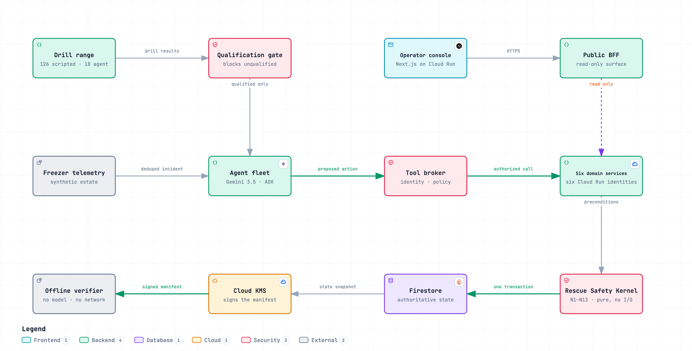
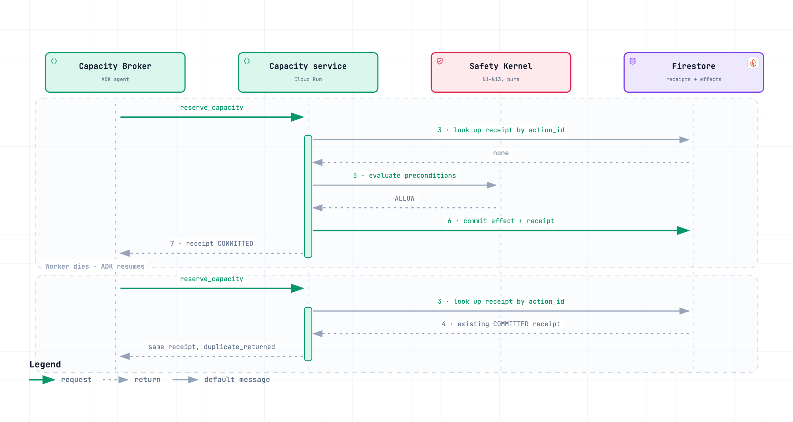

# Night Shift

**Night Shift coordinates research-freezer rescue from alarm to reconciled custody.**

Track: Fortified Enterprise Fleet. All application code was written during the submission
period. First commit `6b49e9c`, 2026-08-26.

A freezer alarm tells a lab that something is wrong. The hard part is everything that has
to happen next: work out whether it is real, find out what is inside, locate space that is
actually safe, get someone on site, track every box that moves, and know, provably, that
nothing was left behind.

Across 126 disclosed disaster-drill runs it passed 126, with 0 capacity-overbooking
violations and 0 duplicate effects under 54 injected faults. That is the deterministic
tier, a fixed policy drives the same broker, services and kernel with no model in the
loop.

Separately, 6 tool calls returned an existing receipt instead of committing a second
effect. Every one came from drill D12, which injects no faults at all, so these are the
idempotency path working on ordinary retries rather than a response to anything going
wrong.

A separate live-agent tier ran 18 runs across 9 of the 21 corpus drills, holdout excluded,
against the real Gemini 3.5 Flash fleet. It passed 17 with 0 N1 and 0 N2 violations. The
two tiers are reported separately and never pooled.

**[Live product](https://nightshift-web-xk6xxtobta-uc.a.run.app)** · [Public API](https://nightshift-api-xk6xxtobta-uc.a.run.app/api/meta) · [Architecture](ARCHITECTURE.md) · [Proof](docs/PROOF.md) · [Claims](docs/CLAIMS.json)

## Deployed

| | |
|---|---|
| Product (start here) | <https://nightshift-web-xk6xxtobta-uc.a.run.app> |
| Live incident | <https://nightshift-web-xk6xxtobta-uc.a.run.app/app/incidents> |
| Fleet and permission matrix | <https://nightshift-web-xk6xxtobta-uc.a.run.app/app/fleet> |
| Disaster drills | <https://nightshift-web-xk6xxtobta-uc.a.run.app/app/drills> |
| Evidence and claim ledger | <https://nightshift-web-xk6xxtobta-uc.a.run.app/app/evidence> |
| Verify a manifest | <https://nightshift-web-xk6xxtobta-uc.a.run.app/verify> |
| Public API | <https://nightshift-api-xk6xxtobta-uc.a.run.app/api/meta> |

Google Cloud `project-2ac1d1fb-7da1-46b4-90e`, region `us-central1`. Six domain services and the public API run as separate Cloud Run services under separate service accounts.

---

## Who this is for

The unlikely hero here is a biobank lab manager at 2am. Not a developer, and not a standard
corporate role either. A laboratory operations manager, biobank technician, or
research-core facility responder who takes the freezer alarm and personally becomes the
orchestration layer for the next several hours: deciding whether the event is real,
identifying affected material, locating backup capacity, contacting the right people,
starting the repair, preserving sample identity, coordinating physical movement, recording
where every box went, tracking what is still unaccounted for, restoring normal operations,
and writing it all up afterwards.

They do that alone, at night, from a phone, while the material degrades. The buyers behind
them are university research core facilities, institutional biobanks, biotech and pharma
R&D sites, hospital research repositories, and the freezer-monitoring and LIMS vendors who
want a response layer to hand their customers.

It helps to say what this is not, because the shape of the user follows from it. Night
Shift is not a temperature sensor vendor, a freezer monitoring dashboard, a chatbot for
scientists, a generic multi-agent framework, a LIMS replacement, a robotics system, a
compliance certification product, or an agent testing product wearing a laboratory skin.
The product is incident response. The assurance plane exists to make incident response
trustworthy.

## The mechanism

```
live incident evidence
  → specialist agents plan and delegate
    → tool broker restricts reachable tools by identity
      → deterministic Rescue Safety Kernel validates preconditions
        → idempotent domain service commits the effect
          → immutable receipt enters the incident ledger
            → incident advances only when the required evidence exists
```

One rule holds it together:

> **Agents decide what to do. Deterministic code decides what is true and whether state
> may change.**

Gemini 3.5 Flash interprets noisy telemetry, prioritises material, and chooses among valid
backup options. It is never the authority on whether capacity exists, whether an effect
already happened, whether a responder is authorised, or whether an incident may close.
Those belong to a pure Python safety kernel that the production services and an offline
verifier both call, the same code, on the same inputs.

<picture>
  <source media="(prefers-color-scheme: dark)" srcset="docs/diagrams/preview/architecture.dark.png">
  <source media="(prefers-color-scheme: light)" srcset="docs/diagrams/preview/architecture.light.png">
  
</picture>

The same map is also an interactive artifact with guided views that walk one path at a
time: [`docs/diagrams/night-shift-architecture.html`](docs/diagrams/night-shift-architecture.html).
It is a single self-contained file, so it opens straight from disk with no server and no
network.

## What actually runs

Six ADK specialists on Gemini 3.5 Flash, six Cloud Run domain services under six distinct
Google service accounts, Firestore transactions enforcing capacity conservation, Cloud KMS
signing every evidence manifest, Cloud Storage holding the published evidence bundles,
Cloud Trace carrying the spans, and Model Armor screening untrusted vendor content.

Eleven Google services are in the deployed path: Vertex AI, Cloud Run, Cloud IAM,
Firestore, Cloud KMS, Cloud Storage, Cloud Trace, Model Armor, Cloud Scheduler, Artifact
Registry, and Cloud Build. Pub/Sub topics are provisioned but nothing publishes to them,
so it is listed under what is not delivered in [LIMITATIONS.md](LIMITATIONS.md) rather
than here.

Model access path: Gemini 3.5 Flash through Vertex AI, with
`GOOGLE_GENAI_USE_VERTEXAI=TRUE` and the model served from the `global` endpoint. Regional
infrastructure stays in `us-central1`. The split is deliberate and documented in
`nightshift/common/config.py`.

| Agent | Owns | Cannot touch |
|---|---|---|
| Incident Commander | the plan, delegation, closure requests | anything mutable |
| Signal Investigator | is this a real failure? | specimens, capacity, custody |
| Impact Analyst | what is affected and how urgently | capacity, custody, facilities |
| Capacity Broker | finding and reserving safe space | custody, facilities |
| Dispatch Agent | work orders and responders | **inventory, entirely** |
| Custody Agent | verifying evidence and committing custody | reservations, work orders |

Read that table by its gaps. A compromised Commander can request a plan change and nothing
else. The Dispatch Agent has no inventory authority at all, which is why a poisoned vendor
reply asking it to export the specimen list has nothing to reach, at four independent
layers, ending with Cloud Run IAM refusing the call before it reaches our code.

## Thirteen invariants, checked twice

| | Invariant | What it prevents |
|---|---|---|
| N1 | Capacity conservation | Two incidents booking the same slots |
| N2 | Exactly-once effects | A retry creating a second real effect |
| N3 | Valid custody prerequisite | Recording a move the evidence does not support |
| N4 | Fresh destination evidence | Committing into a freezer that has warmed |
| N5 | Complete reconciliation | Closing with material unaccounted for |
| N6 | No premature close | Closing while anything is uncertain |
| N7 | Least-privilege effect authority | The wrong agent producing an effect |
| N8 | Memory non-authority | Acting on remembered rather than current state |
| N9 | Duplicate event safety | Redelivery multiplying effects |
| N10 | Revision qualification | An unqualified revision taking real work |
| N11 | Fail closed on contradiction | Inventing success from partial evidence |
| N12 | Failure attribution | Blaming the agent for infrastructure failing |
| N13 | Containment integrity | Normal traffic continuing on a failed freezer |

The services check them before committing. The verifier recomputes them afterwards from
the stored state snapshot, with no model and no network:

```bash
python -m nightshift.verify --manifest evidence/incidents/<id>.manifest.json
```

Editing the state produces a hash failure *and* a divergent verdict. Editing the stored
verdict produces a divergence alone. Editing the signature fails signature verification.
All three are reported separately, so a mismatch says which happened. An unsigned manifest
reports `PARTIAL`, never `PASS`.

## The finding that shaped the design

PRD §22 asks what ADK does to an effectful tool on resume. Rather than assume, three
interruption shapes were provoked against a real Gemini-backed run:

| How the run ended | Tool re-invoked on resume? |
|---|---|
| a plugin raised after the tool returned | no |
| the tool itself raised after committing | no |
| **the invocation was cancelled mid-flight** | **yes** |

Only the third, a worker actually dying, re-invokes. That run made 2 tool calls and
produced 1 committed effect, because the semantic action ID was identical and the second
call replayed the first call's receipt.

If you test resume safety by raising from a plugin, you will observe no re-invocation and
conclude idempotency is optional. Then a pod eviction produces the third shape and you
have booked the freezer twice. Details in [CONTRIBUTIONS.md](CONTRIBUTIONS.md).

This is what the third shape looks like. The same semantic action arrives twice; the
second pass finds the receipt at step 3 and never reaches the kernel or the write:

<picture>
  <source media="(prefers-color-scheme: dark)" srcset="docs/diagrams/preview/exactly-once.dark.png">
  <source media="(prefers-color-scheme: light)" srcset="docs/diagrams/preview/exactly-once.light.png">
  
</picture>

Interactive version:
[`night-shift-exactly-once.html`](docs/diagrams/night-shift-exactly-once.html).

## Spin it up

Two paths. The first needs no Google Cloud account, no credentials, and no billing.

### Local, credential-free

Prerequisites: [uv](https://docs.astral.sh/uv/) 0.5 or newer. Node 20 or newer and pnpm 9
or newer are needed only if you also want to run the web app locally. No `gcloud`, no
Google Cloud account, no billing.

```bash
git clone https://github.com/winsznx/night-shift.git
cd night-shift
```

```bash
make setup-python
```
Installs Python 3.12 through uv and syncs every dependency group. Ends with a short list of
the credential-free targets. Use `make setup` instead if you also want the web app's
Node dependencies.

```bash
make test
```
Unit, property, and integration tests, no credentials touched. Expect a pytest summary
line in under ten seconds, `245 passed` at this commit. The count grows with the suite.
What matters is zero failures.

```bash
make test-all
```
Runs the complete offline suite, including the adversarial tests that exercise denial,
replay, capacity-race, and failure-recovery paths. Expect `289 passed` at this commit and
zero failures. This is the test target used by the repository's full quality gate.

```bash
make drills
```
Runs the whole disaster-drill corpus on the deterministic tier, one seed per drill. Prints
a progress line per run, then:
```
total runs: 21
  scripted: 21/21 passed, 0 infrastructure error(s), N1 violations=0, N2 violations=0
```

```bash
make verify-demo
```
Recomputes every invariant and every hash for each published manifest with no model and no
network, and checks the Cloud KMS signature against the pinned public key. Prints a full
PASS/FAIL line per check, then:
```
2/2 manifest(s) verified PASS.
```
The same document also verifies straight over HTTPS, with no clone:
```bash
uv run python -m nightshift.verify --manifest https://storage.googleapis.com/nightshift-public-evidence-project-2ac1d1fb-7da1-46b4-90e/incidents/INC-0E7C54F8B5/manifest.json
```
That bucket is world-readable and holds manifests, signatures and public keys only. The
bucket holding the Firestore export is a different bucket and is private.

For the complete pre-submission gate, install the web dependencies with `make setup-web`,
then run:

```bash
make check
```

That runs Python lint and formatting checks, Python and TypeScript type checks, the complete
offline test suite, and the secret scan. To prove that the credential-free path does not
depend on untracked files or an existing environment, reproduce it from the committed tree
in a temporary directory:

```bash
make clean-room
```

The clean-room run installs Python dependencies, runs the fast test suite and all 21
deterministic drills, verifies every published manifest, scans for secrets, and compares
the deterministic estate hash. It finishes with `Clean-room reproduction PASSED` or exits
non-zero at the first failed step.

### Cloud

Needs a Google Cloud project with billing enabled. Full detail, including every
environment variable, is in [SETUP.md](SETUP.md).

```bash
gcloud auth login
```
Standard gcloud browser flow. Ends with your account listed as active.

```bash
make bootstrap
```
Enables the APIs and provisions Firestore, the Pub/Sub topics and subscriptions, the
evidence bucket, the Cloud KMS signing key, the Model Armor template, and the Artifact
Registry repository. Exports the signing public key to
`keys/kms-evidence-signer.pub.pem` and prints the `.env` block to copy.

```bash
make deploy
```
Builds one image with Cloud Build and deploys seven Cloud Run services: six authenticated
domain services under six distinct service accounts, plus the public API. Writes every
resolved URL to `infra/deploy/urls.env` and prints them under a `Deployed` heading. This
target does not ship the frontend.

```bash
make deploy-web
```
Separate target, separate Cloud Run service. Builds the Next.js app and deploys it pointed
at the API URL from the previous step, then appends `NIGHTSHIFT_WEB_URL` to
`infra/deploy/urls.env` and prints both URLs.

```bash
make smoke-live
```
Two groups of checks. First it hits `/api/meta`, `/api/overview`, `/api/fleet`,
`/api/drills`, and `/api/evidence` on the deployed API, printing a PASS line per endpoint
with the live model id, store backend, and signer backend on the first. Then it checks
provenance: that the deployed commit is an ancestor of your HEAD, that the manifests the
API serves are byte-identical to the ones in the repo, and that the served claim ledger
matches `docs/CLAIMS.json`. Ends with:
```
8/8 live checks passed against https://<your-api-host>
```
A non-zero exit means the deployment and the repo disagree about something.

## Measured, not asserted

| | |
|---|---|
| Drill runs fully reconciled | 60 of 126 |
| Authorization denials recorded | 24 broker denials across 12 of 126 runs, plus 1 Cloud Run IAM edge denial |
| Published manifests | 2 (1 CLOSED, 84 of 84 containers committed) |
| Median drill wall clock | 0.6s deterministic tier, 191.12s live-agent tier |

Every number above is read from `evidence/campaign/results.json`,
`evidence/campaign-agent/results.json`, `evidence/iam-denial.json`, and the published
manifests by `scripts/generate_readme.py`. None of them is typed. Raw rows, methodology,
and the claim ledger with reproduction commands are in [`evidence/`](evidence/) and
[`docs/CLAIMS.json`](docs/CLAIMS.json).

## Operating envelope

Over the live-agent tier the fleet committed 332 container custody transitions and
finished with 0 containers unresolved. The median run took 191.12 seconds. No human
approved, corrected, or intervened in any of those runs. That is the whole envelope.
Anything outside it has not been measured and is not claimed.


## Honest boundaries

The estate, specimens, studies, and responder roster are synthetic. Responder movements
are simulated, and no real biobank samples were moved. Agents are not registered as managed
Agent Registry or Agent Runtime resources; the delivered authority separation uses
distinct Google service accounts and Cloud Run IAM instead. Semantic Governance and Memory
Bank are local implementations of the specified behaviour, not the managed products.

Every one of those is stated on the specific claim it affects in
[LIMITATIONS.md](LIMITATIONS.md) and [`docs/CLAIMS.json`](docs/CLAIMS.json).

## Documentation

[Architecture](ARCHITECTURE.md) · [Security](SECURITY.md) · [Decisions](DECISIONS.md) ·
[Setup](SETUP.md) · [Limitations](LIMITATIONS.md) · [Proof](docs/PROOF.md) ·
[Contributions](CONTRIBUTIONS.md) · [Phase 0 spike](docs/SPIKE_RESULTS.md)
